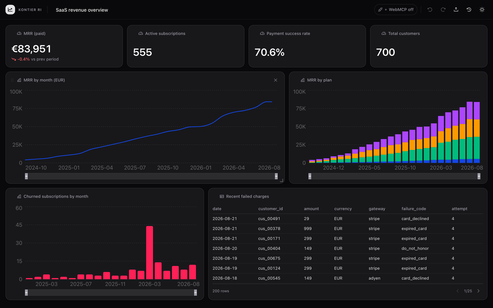
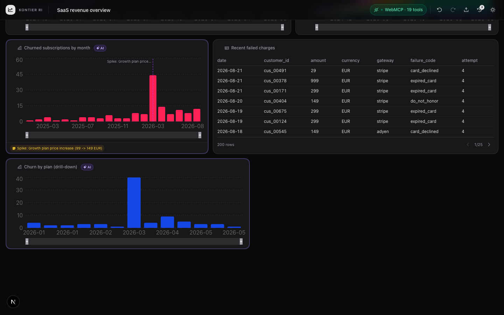

# Kontier RI — Revenue Intelligence Studio

**Build revenue dashboards *with* your AI agent — on the same canvas, at the
same time.** The page registers [WebMCP](https://webmachinelearning.github.io/webmcp/)
tools, so a browser agent (ChatGPT in-app browser, Chrome 149+) gets real hands
inside the BI tool: it profiles your data, writes SQL, drafts tiles, drills
down. You drag, restyle, brush and steer. SQL runs locally via DuckDB-WASM —
**your raw data never leaves the browser.**

**Live demo:** <https://theemperor66.github.io/kontier-ri/>



## What it is

BI tools are the canonical "deep UI" problem: dozens of menus, query builders,
chart editors. Agents guessing their way through that UI fail; a headless API
loses the human. WebMCP is the architecture where the agent operates the *same
live document* the human is looking at:

- **The agent has hands.** 19 static + 3 selection-scoped WebMCP tools:
  query datasets, add/edit/move tiles, set filters, annotate charts.
- **The human stays in control.** Every agent edit is attributed (tiles glow,
  activity feed), undoable (Cmd+Z works on agent commands), and guarded by a
  conflict rule: the agent may not overwrite anything you changed in the last
  10 minutes — it has to ask.
- **Your gestures are agent context.** Brush a revenue dip, ask "why?" — the
  agent reads your selection via `get_user_focus`, investigates with SQL, and
  answers with a drill-down tile + annotation next to the chart.



## 60-second quickstart

1. Open the live demo: **<https://theemperor66.github.io/kontier-ri/>**
   - **Chrome 149+:** enable `chrome://flags/#enable-webmcp-testing`, restart,
     then use an agent that speaks WebMCP (e.g. Chrome's built-in testing
     surface or an extension).
   - **ChatGPT in-app browser:** open the URL inside ChatGPT and chat — the
     page's tools appear to the agent automatically.
2. Click **Load demo dashboard** (24 months of synthetic SaaS billing data),
   or upload your own CSV/Parquet.
3. Ask the agent things like:
   - *"What datasets do you see? Profile them and build me a revenue dashboard."*
   - *"Why did churned subscriptions spike in March 2026? Drill down and annotate the chart."*
   - *"Add a KPI for failed payment volume this month."*
   - *"Switch the dashboard to a light theme and retitle it."*

No sign-up, no backend, no credentials — everything runs in the page.

## Tool catalog

22 tools, registered from the page via `document.modelContext`
(feature-detecting `navigator.modelContext`). Full contracts:
[docs/TOOLS.md](docs/TOOLS.md).

| Group | Tools | Notes |
|---|---|---|
| Data (read-only) | `list_datasets`, `get_dataset_schema`, `profile_column`, `sample_rows`, `run_sql` | SELECT-only guard, row caps; DuckDB SQL dialect |
| Dashboard build (mutating) | `add_tile`, `update_tile`, `move_tile`, `remove_tile`, `set_global_filter`, `clear_global_filters`, `set_date_range`, `set_theme`, `set_dashboard_title`, `add_annotation` | all routed through the command layer: attributed, undoable, conflict-checked |
| Context (read-only) | `get_dashboard_state`, `get_user_focus`, `describe_tile`, `get_activity_log` | `get_user_focus` exposes selection + brushed chart ranges |
| Selection-scoped (dynamic) | `edit_selected_tile`, `restyle_selected_tile`, `explain_selected_tile` | mounted/unmounted by React lifecycle while a tile is selected |

## Architecture

```
kontier-ri/
├── apps/web/            # Next.js 16 studio app (the live URL)
├── packages/studio/     # dashboard store, tiles, WebMCP tools + hook
├── packages/datasource/ # DataSource interface + DuckDB-WASM implementation
├── scripts/             # demo-data seeder (deterministic synthetic billing)
└── docs/                # plan, tool catalog, WebMCP API notes
```

- **DataSource seam.** Everything queries a small `DataSource` interface
  (`listDatasets`, `getSchema`, `runQuery`, `profileColumn`, `importFile`).
  The demo binds DuckDB-WASM; a SaaS can bind its analytics API instead
  without touching the studio.
- **One schema, twice used.** Every tool input is a zod v4 schema:
  `z.toJSONSchema()` produces the WebMCP `inputSchema`, `safeParse`
  re-validates the same shape at execute time. No drift possible.
- **Dynamic tools from component lifecycle.** `useWebMCPTool` registers on
  mount and unregisters via `AbortController` on unmount — so selecting a tile
  literally changes the agent's toolset.
- **Conflict rule.** The store tracks recent human edits per property; a
  mutating tool that would overwrite one returns a conflict notice (the agent
  must ask or pass `force: true`), keeping the human authoritative.
- **Self-hosted engine.** duckdb-wasm bundles are copied into `public/duckdb/`
  at build time and served same-origin (CDN only as fallback).

## Privacy

All SQL executes in a DuckDB-WASM instance inside your tab. Uploaded files are
registered in-memory in the browser. There is no backend, no telemetry, and no
data upload; an agent only ever sees the row-capped aggregates it explicitly
queries through the tools.

## Why AGPL-3.0

The same license family as Grafana and Metabase's core: free to use, study,
modify and self-host; if you offer a modified version as a network service,
you share your changes under the same terms. That keeps an analytics studio —
software that typically runs as a service — honestly open.

## Built by a billing SaaS team

We build [Kontier](https://kontier.eu), a billing/subscription SaaS. Kontier RI
is our take on the analytics engine we want inside our own product: the
`DataSource` seam exists precisely so this studio can later bind to a
production billing API instead of in-browser CSVs. This is not a toy — it is
the roadmap.

## Development

```bash
pnpm install
pnpm dev                    # studio at http://localhost:3000
pnpm -r build               # build all packages + the app
pnpm -r test                # vitest (packages) — studio store/schemas/tools
pnpm --filter web test:e2e  # Playwright smoke tests (starts its own server)
pnpm seed                   # regenerate the demo CSVs deterministically
```

Deploys: pushing to `main` builds a static export (`NEXT_OUTPUT=export`,
basePath `/kontier-ri`) and publishes it to GitHub Pages via
`.github/workflows/deploy.yml`. A root-path deploy (e.g. Vercel) needs no env
at all.

See [docs/PLAN.md](docs/PLAN.md) for the full design and roadmap, and
[docs/webmcp-api-notes.md](docs/webmcp-api-notes.md) for WebMCP API findings.
