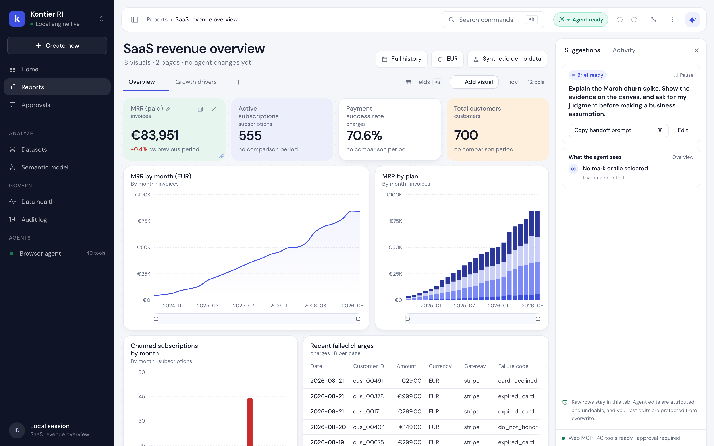
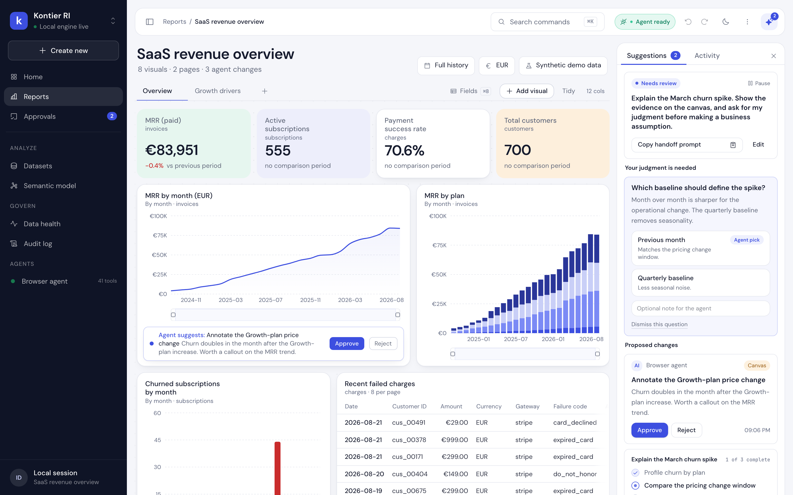
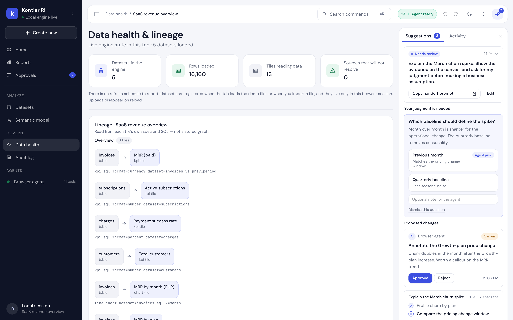

# Kontier RI — Revenue Investigation Workspace

**A human and a browser agent investigate the same live dashboard.** You write
a brief, point at a signal, and approve the work. The agent reads that context
through [WebMCP](https://webmachinelearning.github.io/webmcp/), publishes a
plan, queries the data, asks you structured questions, and proposes changes you
review as a staged change set. SQL runs locally in DuckDB-WASM, so **your raw
data never leaves the browser.**

**Live demo:** <https://theemperor66.github.io/kontier-ri/>



## The shared investigation loop

Kontier RI is not a chat box bolted onto a dashboard. The dashboard itself is
the shared context. One work session runs like this:

1. **You write a brief.** Example: "Explain the March churn spike and show the
   evidence." The brief becomes a work session with a visible phase.
2. **The agent orients.** It calls `get_work_context` first. That returns the
   brief, the shared plan, pending reviews, decisions and their answers, staged
   change sets and their status, your live focus
   (page, selected tile, brushed range, cross-filter, recent edits), the last
   10 commands, and the working agreement.
3. **The agent publishes a plan.** `present_plan` shows the steps.
   `update_plan_step` ticks them off while it works.
4. **The agent asks when it must.** `request_decision` creates a structured
   question with 2 to 5 options, context, and an optional recommendation. You
   answer in the UI. The answer appears in the agent's next
   `get_work_context` read.
5. **The agent proposes, you approve.** `propose_insight` puts a finding and an
   optional action in the review queue. Nothing is applied until you press
   Approve.
6. **Bigger work arrives as one staged change set.** `propose_change_set`
   groups 1 to 8 related edits (add a tile, edit a tile, remove a tile,
   annotate, set a filter, scope a tile) with a reason per row. Nothing runs on
   propose. You read the set as a diff, skip the rows you do not want, and
   approve the rest. The kept rows run through the normal command layer and
   collapse into **one** undo entry and **one** activity entry. A partial
   approval is recorded as `partially_applied` with the exact rows that ran.
   If a row fails mid-apply, the document and the history are restored exactly
   and the set stays open for review.
7. **The agent closes the loop.** `complete_work` writes a summary and an
   outcome list into the session.

The agent observes your verdicts on its next `get_work_context` read: that call
returns the decisions and the change sets with their current status. There is
no push channel.

**The toolbelt follows the work.** 40 tools are always registered. Three small
bundles mount and unmount with the state of the session: 3 tools while a tile
is selected, 2 while a change set waits for you (`revise_change_set`,
`withdraw_change_set`), and 1 while a question waits (`withdraw_decision`).
Each bundle is a React component, so the agent's options are always the ones
that make sense right now.

Approved actions run through the same command layer as your own edits. Every
one is attributed to the agent, logged, and undoable. The agent may not
silently overwrite a property you changed in the last 10 minutes. It gets a
conflict result and has to ask.



## The workspace

A 256px navy navigation rail on the left, a light canvas in the middle, and a
340px agent panel on the right.

**Navigation rail.** Home, Reports, Approvals (with a pending badge), Datasets,
Semantic model, Data health, Audit log, plus a live agent runtime row.

**Agent panel.** Two tabs. *Suggestions* holds the brief, the session phase,
the live plan, open decisions, staged change sets, and proposals waiting for
review. *Activity* is
the real command log with undo. A status footer reports the WebMCP connection
and the number of tools that registered. Nothing renders in this panel unless a
real tool call or a real human action produced it.

**Canvas.** A 12-column grid with drag, resize, snap guides, cross-filtering,
brushing, and a tile inspector. A focus ribbon appears when a selection, brush,
or cross-filter is active, so you can see what the agent will read. Below 720px
of canvas width the grid reflows into a stacked review layout and drag/resize
is turned off.

**Field pane.** ⌘B or the **Fields** button opens the data rail between the
navigation rail and the canvas. It lists the live datasets with their row
counts and every column with a role glyph (measure, time, dimension) derived
from the DuckDB type. Search filters the fields; right-click profiles one
against live data (distinct values, nulls, top values). Click a field to
scaffold a tile — a numeric field becomes a KPI, a dimension or date becomes a
chart grouped by that field with the best-ranked measure — or drag it onto the
canvas to drop the same scaffold at the grid cell under the pointer. Every add
goes through the human command layer, so it is attributed and undoable. While
you hover, focus or drag a field, it is published to the agent as
`hoveredField` (dataset, column, type) in `get_user_focus` and
`get_work_context`, exactly like a selection or a brush.

**Version history.** Named snapshots of the report, kept in this browser (20
per dashboard) and opened from the overflow menu or ⌘K. One is taken
automatically before a staged change set is applied ("Before <title>"), so
agent work always leaves a restore point, and restoring snapshots what it
replaces ("Before restore"). A restore loads that document through the normal
dashboard-load path.

**Add visual.** Your own authoring path, and the human mirror of the agent's
`add_tile`. Pick a dataset, a field to group by, a measure and an aggregate,
then a visual type (KPI, bar, line, area, donut, table). The dialog previews
the real tile with the real renderer and the real query engine before you add
it. Adding commits one undoable human command.

**Past investigations.** When a session completes, its brief, summary,
outcomes and the decisions you made are written to this browser and listed on
Home. History is local only, capped at 50 records, read-only, and you can clear
it with one click.

**Non-canvas views.** Every one reads live product state only:

| View | What it shows |
|---|---|
| Home | Engine status, the live approval queue, the current session, saved dashboards, the recent command log, and past investigations kept in this browser |
| Approvals | Real `propose_insight` proposals, `propose_change_set` change sets (skip rows, then approve), and `request_decision` questions, with Approve / Reject and per-option answers |
| Datasets | Every table the engine can see now, grouped by origin (demo, uploaded, view), with row and column counts read from DuckDB |
| Semantic model | Engine tables and their fields, the dashboard's calculated fields, and its SQL views |
| Data health | Tile-to-dataset lineage derived from tile specs, plus engine facts |
| Audit log | The real command log, filterable by agent or human, with undo on the newest undoable command |

### BI depth



- **12 chart types**: line, bar, area, pie, donut, scatter, combo (dual axis),
  horizontal bar, stacked 100%, funnel, heatmap, radar. Plus trendlines,
  reference lines, and conditional formatting rules.
- **Cross-filtering**: click a bar, slice, point, or cell and every other tile
  filters. The agent reads it through `get_user_focus` and `get_work_context`.
- **Calculated fields and SQL views**: define `arpu` once and use it anywhere.
  Views appear as datasets.
- **Pages, dashboards, templates**: multi-page documents, a local dashboard
  manager, 3 starter templates.
- **⌘K command palette**, presentation mode, PNG/CSV export, share URLs,
  autosave to local storage.
- **Scale**: aggregate 100 million rows in the tab. The demo reads a remote
  511 MB parquet dataset in 8 quarterly partitions over HTTP range requests.
  Quarter-scoped queries prune 7 of the 8 files.

## Quickstart

1. Open the live demo: **<https://theemperor66.github.io/kontier-ri/>**
   - **ChatGPT in-app browser:** open the URL and chat. The page's tools appear
     to the agent automatically.
   - **Chrome 149+:** enable `chrome://flags/#enable-webmcp-testing`, restart,
     then use an agent that speaks WebMCP.
2. Load the demo dashboard (24 months of synthetic SaaS billing data), pick a
   template, or upload your own CSV or Parquet file.
3. Write a brief in the agent panel and press **Share brief**.
4. Tell your agent to pick it up, for example: *"Pick up the active brief in
   Kontier RI. Read get_work_context first, share a plan, and use
   request_decision when my judgment is needed."*
5. Answer its questions in Approvals. Approve or reject its proposals. In a
   staged change set, untick the rows you do not want and approve the rest;
   one Cmd+Z reverts the whole set.

The workspace stays fully usable without an agent. There is no sign-up, no
backend, and no credentials.

## Tool surface

The page registers **40 static tools**. Three phase-scoped bundles add up to
**6 more**: 3 while a tile is selected, 2 while a change set waits for review,
1 while a decision waits for an answer — **46 at the maximum**. Registration
happens through `document.modelContext` with a `navigator.modelContext`
fallback. Full contracts: [docs/TOOLS.md](docs/TOOLS.md).

| Group | Tools | Notes |
|---|---|---|
| Data (read-only) | `list_datasets`, `get_dataset_schema`, `profile_column`, `sample_rows`, `run_sql` | SELECT-only guard, row caps, DuckDB SQL dialect |
| Dashboard build | `add_tile`, `update_tile`, `move_tile`, `remove_tile`, `set_global_filter`, `clear_global_filters`, `set_date_range`, `set_theme`, `set_dashboard_title`, `add_annotation`, `set_tile_filters`, `set_cross_filter`, `clear_cross_filter` | routed through the command layer: attributed, undoable, conflict-checked |
| Pages and model | `add_page`, `rename_page`, `remove_page`, `switch_page`, `create_calculated_field`, `list_calculated_fields`, `remove_calculated_field`, `create_view`, `remove_view` | views are SELECT-only and namespaced `view_*` |
| Context (read-only) | `get_dashboard_state`, `get_user_focus`, `describe_tile`, `get_activity_log`, `export_tile_data` | `get_user_focus` exposes selection, brush, and cross-filter |
| Presence | `present_plan`, `update_plan_step`, `propose_insight`, `clear_plan` | plan card and review queue; proposals apply only on human Approve |
| Collaboration | `get_work_context`, `request_decision`, `complete_work`, `propose_change_set` | the orientation, question, staged-change and close-out protocol |
| Selection-scoped (3) | `edit_selected_tile`, `restyle_selected_tile`, `explain_selected_tile` | registered and unregistered by React lifecycle while a tile is selected |
| Proposal-scoped (2) | `revise_change_set`, `withdraw_change_set` | registered only while a change set is still `proposed`; both fail once it is applied or rejected |
| Decision-scoped (1) | `withdraw_decision` | registered only while a question is unanswered |

Read tools carry `readOnlyHint` and `untrustedContentHint`. Read results can
echo dataset names, cell values, and human-written text, so a capable host can
keep that content out of instruction authority while still using it as data.

## Honest connection status

The status pill reports real registration results, not feature detection.

- The registry tracks each tool's lifecycle: `unavailable`, `registering`,
  `ready`, `failed`, or `unregistered`.
- "Agent ready" appears only when every expected tool reported `ready`. The
  tooltip states how many registered.
- Partial states show "Connecting N/M".
- A failure shows "Agent setup issue" and lists the failing tool names with
  their error text.
- Some hosts inject `modelContext` after hydration. The hook re-checks once per
  second until the runtime appears, then registers once.

## Architecture

```
kontier-ri/
├── apps/web/            # Next.js 16 app: shell, canvas, workspace views, presence
├── packages/studio/     # dashboard store, command layer, WebMCP tools + hook
├── packages/datasource/ # DataSource interface + DuckDB-WASM implementation
├── scripts/             # deterministic synthetic billing seeder
└── docs/                # design spec, tool catalog, overhaul plan, WebMCP notes
```

- **DataSource seam.** Everything queries a small `DataSource` interface
  (`listDatasets`, `getSchema`, `runQuery`, `profileColumn`, `importFile`). The
  demo binds DuckDB-WASM. A SaaS can bind its analytics API instead without
  touching the studio.
- **One schema, twice used.** Every tool input is a zod v4 schema.
  `z.toJSONSchema()` produces the WebMCP `inputSchema` and `safeParse`
  re-validates the same shape inside `execute`. The contract cannot drift.
- **Dynamic tools from component lifecycle.** `useWebMCPTool` registers on
  mount and unregisters through an `AbortController` on unmount. Selecting a
  tile literally changes the agent's toolset, and so does a pending change set
  or an open question: the proposal and decision bundles mount with the queue
  and name the live ids in their descriptions.
- **Command layer.** Every mutation carries an origin (`human` or `agent`), a
  label, an undo entry, and an activity log line.
- **Conflict rule.** The store keeps a 10-minute window of human edits per
  property. A mutating tool that would overwrite one returns a conflict notice.
  The agent must ask or pass `force: true`.
- **Session state is ephemeral.** Briefs, plans, decisions, change sets, and
  proposals live in the working session. Committed dashboard edits go to the
  persisted document and the undo stack. Applying a change set is the one
  place where many commands collapse into a single undo entry: the review is
  the unit of work, not its individual rows.
- **Self-hosted engine.** duckdb-wasm bundles are copied into `public/duckdb/`
  at build time and served same-origin. The CDN is only a fallback.

### How registration looks

```ts
document.modelContext.registerTool(
  {
    name: "get_work_context",
    description: "Call get_work_context FIRST when starting or resuming work…",
    inputSchema: z.toJSONSchema(getWorkContextInput), // zod v4: one schema
    annotations: { readOnlyHint: true, untrustedContentHint: true },
    execute: async (input, options) => readWorkContext(input, options?.signal),
  },
  { signal: controller.signal }, // AbortController -> unregister on unmount
);
```

That call lives behind the `useWebMCPTool` hook in
`packages/studio/src/webmcp/useWebMCPTool.ts`.

## Privacy

All SQL runs in a DuckDB-WASM instance inside your tab. Uploaded files are
registered in browser memory only. There is no backend, no telemetry, and no
upload. An agent sees only the row-capped, aggregated results of the tools it
calls.

## What this build does not claim

The design language of an enterprise BI suite is easy to fake. This build shows
only facts it can prove:

- WebMCP does not expose which agent is calling, so the UI says "Browser
  agent". There is no invented assistant persona.
- There are no refresh schedules, dataset owners, or access lists, because the
  app has no scheduler and no directory.
- Lineage is derived from the tile specs, not from an external catalog.
- Presence renders only from real tool calls and real human input. No timers
  simulate agent activity.

## Why AGPL-3.0

The same license family as Grafana and Metabase's core: free to use, study,
modify, and self-host. If you offer a modified version as a network service,
you share your changes under the same terms. That keeps an analytics studio,
software that usually runs as a service, honestly open.

### Trademark

The **"Kontier" name and logo are trademarks of the project owner** and are
used here with permission. The AGPL-3.0 license covers the code, not the brand.
Forks and redistributions must not use the Kontier name or logo in a way that
suggests endorsement or origin.

## Built by a billing SaaS team

We build [Kontier](https://kontier.eu), a billing and subscription SaaS.
Kontier RI is our take on the analytics engine we want inside our own product.
The `DataSource` seam exists so this workspace can later bind to a production
billing API instead of in-browser CSVs.

## Development

```bash
pnpm install
pnpm dev                    # workspace at http://localhost:3000
pnpm -r build               # build all packages + the app
pnpm -r test                # vitest: 254 unit tests (datasource 40, studio 214)
pnpm --filter web test:e2e  # 35 Playwright tests (starts its own server)
pnpm -r typecheck           # tsc --noEmit across the workspace
pnpm seed                   # regenerate the demo CSVs deterministically
```

Deploys: pushing to `main` builds a static export (`NEXT_OUTPUT=export`,
basePath `/kontier-ri`) and publishes it to GitHub Pages through
`.github/workflows/deploy.yml`. A root-path deploy needs no environment
variables.

Further reading: [docs/DESIGN-SPEC.md](docs/DESIGN-SPEC.md) for the visual
contract, [docs/TOOLS.md](docs/TOOLS.md) for tool contracts,
[docs/OVERHAUL-PLAN.md](docs/OVERHAUL-PLAN.md) for the product roadmap, and
[docs/webmcp-api-notes.md](docs/webmcp-api-notes.md) for WebMCP API findings.
